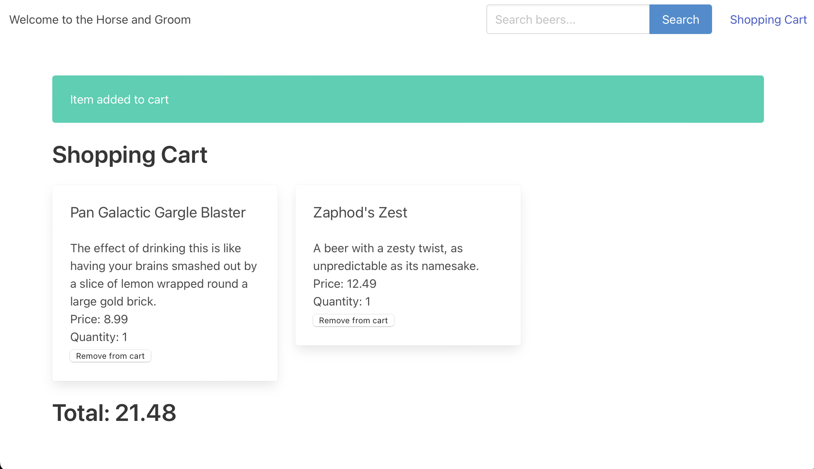

# The Horse and Groom - Shop Cart Challenge

---

made 🛠️ with love 💖 on earth 🌍 by robots 🤖 supervised by humans 👥

---

## Name and theme origination

https://hitchhikers.fandom.com/wiki/The_Horse_and_Groom

```
The Horse and Groom was the name of the pub close to Arthur Dent's house, in the village of Cottington. It was probably his local pub, as in the video game it was just down the lane from Arthur's house. The pub name was changed to The Red Lion in the 1981 television series.

Ford Prefect and Arthur use it for stocking up on necessary protein restoratives and muscle relaxants (alcohol and peanuts) before their journey through Hyperspace to the Vogon ship, which they hitch-hike onto using the Electronic Thumb.
```

---


This was made by Microsoft Copilot with directions from me.

# NOT FOR PRODUCTION [seriously don't]


See link for challenge:

https://github.com/microsoft/CopilotHackathon/blob/main/challenges/eshop/eshop.md


The goal of this challenge is to develop a shop cart. The shop cart should allow users to add and remove products.

The topic selected is beer. You can use the `beers.json` file in the root of the eshop project to get the list of beers for building the Rest API.

## Features
- [X] Create a Rest API with methods to:
  - [X] Get the beers list with page offset and limit.
  - [X] Get beer details by id.
  - [X] Search beers by name, description, tagline, food_pairing, price.
- [X] Create a list of products in the main page.
- [X] Create a search bar to filter the products.
- [X] Navigate to the description page when the user clicks on a product.
- [ ] (Optional) Slicer to filter the products by price.
- [X] Create a shop cart.
  - [X] Add a product to the shop cart.
  - [X] Remove a product from the shop cart.
  - [X] Calculate the total price of the products in the shop cart.

We are using Python and Flask to build the Rest API. The front end is built using HTML, CSS, and JavaScript.

## Screenshots

The main site


The cart loaded



## Project Structure

- eshop
  - `app.py`
  - `beers.json`
  - static
    - `style.css`
  - templates
    - `base.html`
    - `beer.html`
    - `index.html`
    - `search.html`
    - `shopcart.html`
  - utils
    - `shopcart.py`
  - `venv`
  - `requirements.txt`
  - `Procfile`
  - `runtime.txt`
  - `README.md`
  - `.gitignore`

The `app.py` file contains the Rest API methods and the routes for the front end. The `beers.json` file contains the list of beers. The static folder contains the CSS file for styling. The templates folder contains the HTML files for the front end. The utils folder contains the `shopcart.py` file for managing the shop cart. The `venv` folder contains the virtual environment. The `requirements.txt` file contains the required packages. The `Procfile` and `runtime.txt` files are for deployment on Heroku. The `README.md` file contains the project description. The `.gitignore` file contains the files to be ignored by Git.
